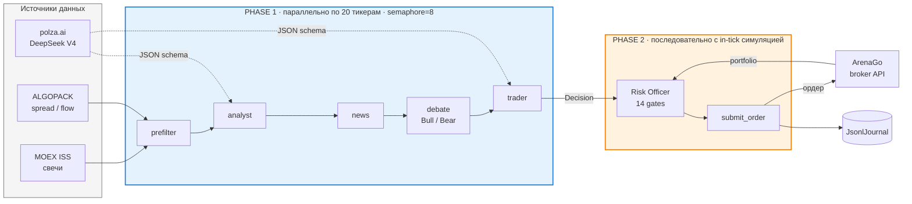
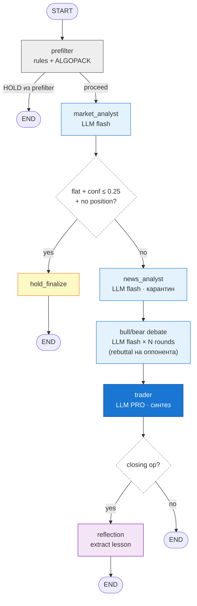
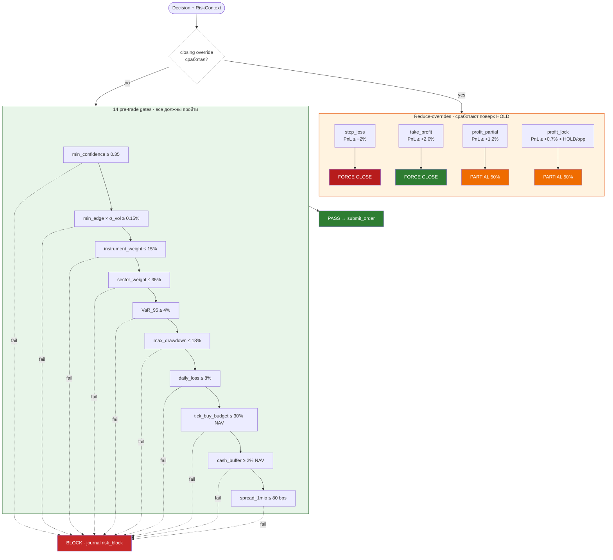
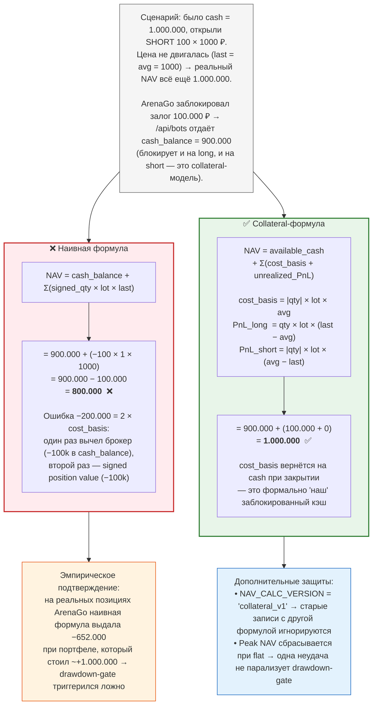
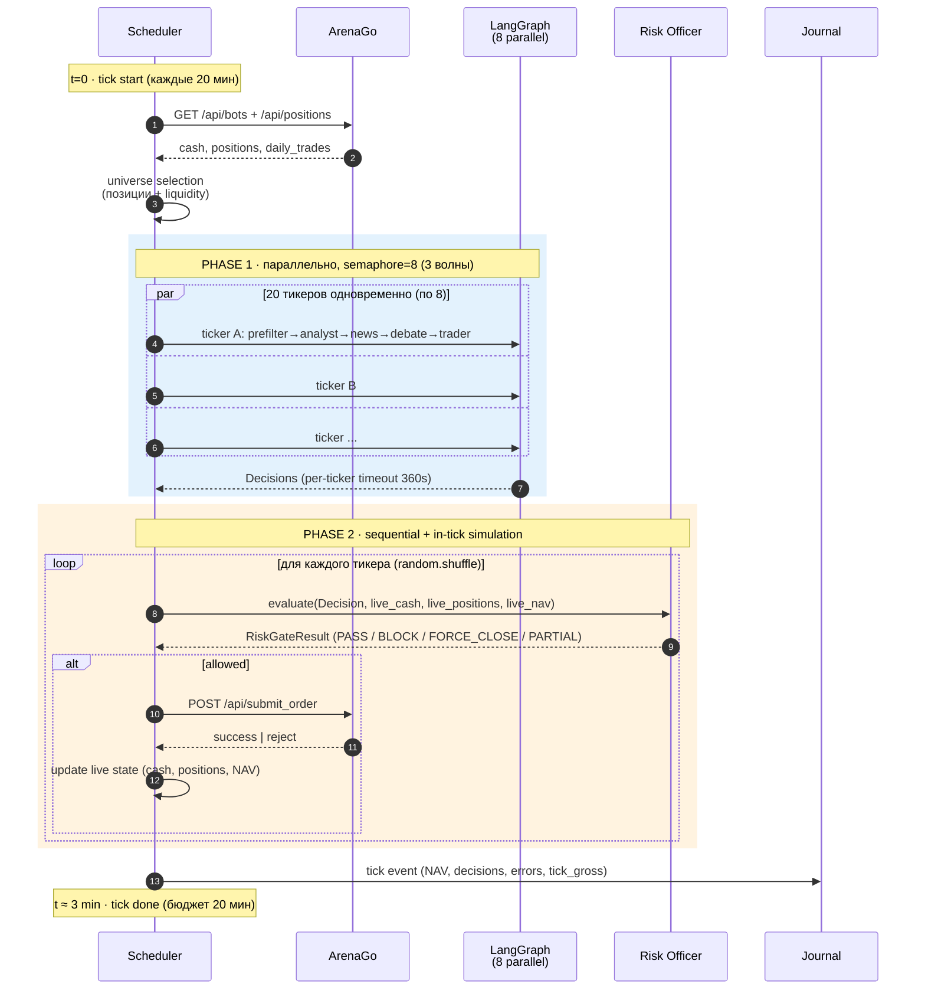

# team-24 — автономный торговый агент MOEX

**Хакатон MOEX AI 2026 · команда 24**

Документация финального решения для жюри: проблема, архитектура, дизайн-решения, инструкции для воспроизведения.

---

## 1. О проекте

**Что это:** автономный многоагентный LLM-бот, который сам анализирует акции MOEX, принимает торговые решения и выставляет ордера через брокерское API ArenaGo.

**Технические рамки:**
- Универс: 20 ликвидных бумаг ТQBR (SBER, GAZP, LKOH, GMKN, ROSN, NVTK, PLZL, MOEX, T, MGNT, PIKK, ALRS, AFLT, YDEX, ROSN, SNGSP и др.)
- Тик: 20 минут (расписание агента, не свечей)
- Свечи: 10 минут, окно 14 дней (≈520 баров)
- LLM: open-source DeepSeek V4 (MIT-лицензия)
- Брокер: ArenaGo
- Бюджет: ~6000 ₽ на LLM-токены, floor оборота 10М ₽ за 10 дней

**Метрика:** максимизация прибыли при соблюдении floor оборота и риск-лимитов.
---

## 2. Решение в двух абзацах

Один тик = один проход pipeline:
**Universe selection → параллельная LLM-фаза (analyst → news → debate → trader) → последовательная risk-фаза (Risk Officer → submit_order) → reflection**.

Каждый тикер обрабатывается **независимым LLM-графом** (LangGraph), внутри которого технический аналитик строит контекст, новостной аналитик квалифицирует sentiment, **Bull/Bear debate** генерирует две противоположные гипотезы, а **trader** синтезирует финальное BUY/SELL/HOLD. **Risk Officer** — детерминированный (без LLM) — проверяет 14 гейтов (VaR, drawdown, daily-loss, profit-lock, take-profit/stop-loss, concentration, spread из ALGOPACK, edge × volatility и др.), может срезать размер или принудительно закрыть позицию **поверх** сигнала трейдера. Все ордера отправляются через ArenaGo REST с retry-логикой и идемпотентностью.

---

## 3. Архитектура (контекст и слои)


**Точка входа:** `uvicorn agent.api.main:app` → FastAPI lifespan стартует фоновый `TradingScheduler` как `asyncio.Task`. HTTP-поверхность намеренно сведена к `GET /health` для k8s-проб ([routes.py:16](src/agent/api/routes.py:16)) — мутирующие ручки удалены, чтобы утечка токена не давала доступа к торговле.

---

## 4. LangGraph: граф агентов

### 4.1 Топология




Топология строится в [graph/build.py](src/agent/graph/build.py); conditional edges — в [graph/routing.py](src/agent/graph/routing.py). State (`GraphState`) — TypedDict из [graph/state.py](src/agent/graph/state.py).

### 4.2 Per-role LLM-модели

В Dockerfile задан явный override моделей по ролям ([Dockerfile:18-23](Dockerfile:18)):

| Роль | Модель | Обоснование |
|---|---|---|
| analyst | deepseek-v4-flash | Структурированный вывод по индикаторам, объём контекста маленький |
| news | deepseek-v4-flash | То же — фиксированный output schema |
| debate (bull/bear) | deepseek-v4-flash | Раунд короткий, нужна скорость для нескольких циклов |
| trader | **deepseek-v4-pro** | Финальный синтез с reasoning, видит весь контекст |

Кэш клиентов — по модели, не по роли ([llm/client.py](src/agent/llm/client.py)) — экономит httpx-соединения при множественных параллельных вызовах одной модели.

### 4.3 Контракты узлов (Pydantic)

Все LLM-узлы используют `structured outputs` (json_schema через OpenAI beta.parse, с fallback на `json_object`). Схемы — в [schemas.py](src/agent/schemas.py):

- `AnalystOutput`: trend, momentum, volatility (enum), summary, confidence
- `NewsAnalystOutput`: sentiment, key_events, citations, confidence, raw_news_count
- `BullArgument` / `BearArgument`: thesis, key_points, confidence, **rebuttal** (для раундов > 0)
- `TraderDecision`: signal, size_pct, confidence, reasoning

Невалидный JSON → исключение → tenacity-retry → если 3 попытки не дали валидный output → тикер падает в `errors`, остальная Phase 1 продолжается.

### 4.4 Trader prompt (ключевые правила)

[graph/nodes.py:31-74](src/agent/graph/nodes.py:31):

- **Лонги и шорты разрешены**, `size_pct ∈ [0, 0.15]` — одна позиция не более 15% NAV
- **No single-tick flip через ноль**: противоположный сигнал только закрывает позицию до flat, открытие противоположной — отдельное решение на следующем тике. Поведение жёстко задано `AGENT_ALLOW_FLIP=false` (анти-churn)
- **Risk Officer закрывает сам** при ±1.5%/−2% — трейдер не должен микро-управлять выходом
- **Soft profit-lock** (+0.7%): если трейдер вернёт HOLD или противоположный сигнал, риск-офицер сделает partial close. На +1.2% — partial независимо от сигнала
- **Expected move horizon ~1-2 часа** (10-мин свеча), не микро-тик
- **Commission-aware**: учитывать round-trip ≈0.10% (2× 0.05%) — модель видит это в промпте
- **Live portfolio context** (NAV, cash, gross/net exposure, текущий вес тикера) подаётся в каждый запрос — трейдер масштабирует размер от реального состояния, а не от стартового капитала

---

## 5. Risk Officer (детерминированный)

Без LLM. Принимает `Decision` + `RiskContext` и возвращает `RiskGateResult` ([schemas.py:110](src/agent/schemas.py:110)). Один из ключевых компонентов — он защищает от LLM-галлюцинаций и market shocks.

### 5.1 Гейты (по порядку)



| Гейт | Условие | Действие | ENV |
|---|---|---|---|
| `min_confidence` | confidence < 0.35 | BLOCK | `RISK_MIN_CONFIDENCE` |
| `min_edge × vol` | conf × σ_per_bar × 3.0 < 0.15% | BLOCK BUY/SELL | `RISK_MIN_EDGE_PCT`, `RISK_EDGE_VOL_MULT` |
| `instrument_weight` | \|weight\| > 15% | BLOCK | `RISK_MAX_INSTRUMENT_WEIGHT` |
| `sector_weight` | \|сектор\| > 35% | BLOCK | `RISK_MAX_SECTOR_WEIGHT` |
| `VaR_95` | σ_portfolio × Z95 > 4% | BLOCK | `RISK_MAX_VAR_PCT` |
| `max_drawdown` | (peak − cur) / peak > 18% | BLOCK | `RISK_MAX_DRAWDOWN` |
| `daily_loss` | (open − cur) / open > 8% | BLOCK | `RISK_MAX_DAILY_LOSS` |
| `tick_buy_budget` | sum bought this tick > 30% NAV | BLOCK BUY | `RISK_MAX_TICK_BUY_PCT` |
| `cash_buffer` | < 2% NAV в кэше | BLOCK BUY | `RISK_CASH_BUFFER` |
| `spread_1mio` (ALGOPACK) | > 80 bps | BLOCK OPEN | `ALGOPACK_RISK_SPREAD_1MIO_MAX_BPS` |
| `take_profit` | PnL ≥ +2.0% от avg | FORCE CLOSE | `RISK_TAKE_PROFIT_PCT` |
| `stop_loss` | PnL ≤ −2.0% от avg | FORCE CLOSE | `RISK_STOP_LOSS_PCT` |
| `profit_lock` (soft) | PnL ≥ +0.7% + сигнал HOLD/opposite | PARTIAL (50%) | `RISK_PROFIT_LOCK_*` |
| `profit_partial` | PnL ≥ +1.2% | PARTIAL (50%) независимо от сигнала | `RISK_PROFIT_PARTIAL_*` |

Конкретные значения — [Dockerfile:96-119](Dockerfile:96).

### 5.2 Reduce-overrides

Take-profit, stop-loss, profit-lock могут срабатывать **поверх сигнала HOLD** трейдера и принудительно отправить ордер на закрытие. Реализация — `op_type` с суффиксами `_sell` (закрытие лонга) и `_cover` (закрытие шорта). Сигнал ордера на бирже определяется суффиксом, а не оригинальным `decision.signal`.

### 5.3 NAV под collateral-моделью

ArenaGo при открытии позиции (long или short) **блокирует cost_basis** из cash — `cash_balance` в `/api/bots` это **доступный** кэш после блокировки. Поэтому наивная `cash + Σ(signed_qty × lot × last)` даёт двойной учёт для шортов. Правильная формула ([scheduler.py:_portfolio_nav](src/agent/runtime/scheduler.py)):

```
NAV = available_cash + Σ(cost_basis + unrealized_PnL)
  cost_basis = |position| × lot × average_price
  PnL_long   = position × lot × (last − avg)
  PnL_short  = |position| × lot × (avg − last)
```



История NAV версионируется (`NAV_CALC_VERSION = "collateral_v1"`) — старые записи с другой формулой **игнорируются** при загрузке для гейтов drawdown/daily_loss. Это защита от фантомных просадок после изменений формулы.

**Peak NAV сбрасывается при флэте** (нет открытых позиций) — одна неудачная сделка не парализует drawdown-gate навсегда.

### 5.4 Tick budget (RISK_MAX_TICK_BUY_PCT)

Один тик не может потратить больше 30% NAV на открытия. Защита от одновременного «открыть всё» при множественных BUY-сигналах. Считается gross-нотционал на открытия (лонг и шорт), без зачёта закрытий.

---

## 6. Источники данных

### 6.1 MOEX ISS (apimoex)

Бесплатный публичный API, свечи по `/engines/stock/markets/shares/boards/TQBR/securities/{sym}/candles.json`. Используется как fallback к ALGOPACK и для lot_sizes ([data/moex.py](src/agent/data/moex.py), [data/moex_lots.py](src/agent/data/moex_lots.py)).

### 6.2 ALGOPACK (premium MOEX)

JWT-токен из ALGOPACK даёт доступ к premium-эндпоинтам:
- `tradestats` — 5-минутные агрегаты сделок (disbalance, vwap_buy/sell, volumes, trades count)
- `obstats` — order book stats (spread_bbo, spread_1mio, imbalance)
- `orderstats` — put/cancel orders flow
- `marketdata` / `securities` — справочники

Используется в:
- **Prefilter** ([graph/prefilter.py](src/agent/graph/prefilter.py)): блокирует open при экстремальном disbalance или широком спреде до LLM-вызова
- **Risk Officer**: spread_1mio_bps > 80 → блок открытия
- **Analyst features**: ключи `disb`, `pr_vwap_*`, `ob_*`, `order_*`, `flow_*` подаются в analyst-prompt

ALGOPACK ↔ ISS — единый facade [data/market.py](src/agent/data/market.py), автоматический fallback на ISS если ALGOPACK недоступен.

### 6.3 News (TASS + Interfax + eDisclosure)

[data/news.py](src/agent/data/news.py): RSS + JSON-API, parsing по тикеру MOEX, lookback 24 часа, TTL-кэш 300 секунд, max 5 новостей на тикер.

**Карантин:** новостной аналитик работает в отдельном узле и его вывод подаётся в debate, а не напрямую в trader — защита от prompt-injection через заголовки/тексты RSS.

---

## 7. Память и рефлексия

### 7.1 JsonlJournal (append-only)

[runtime/journal.py](src/agent/runtime/journal.py): JSONL с автодобавлением `ts` и `event`. События:
- `tick` — снапшот тика (NAV, cash, decisions, errors, tick_gross)
- `risk_block` — заблокированные риском сделки
- `risk_clip` — урезанный размер
- `tick_skipped` — пропуск тика (вне сессии, портфель недоступен, лимит сделок)
- `reflection` — извлечённый урок

Журнал на персистентном volume (`DATA_DIR=/data`) → переживает рестарт пода. NAV history, turnover-pace, profit-step ladder — всё восстанавливается из журнала.

### 7.2 Reflection (опционально)

[runtime/reflection.py](src/agent/runtime/reflection.py):
- **Per-trade reflection** срабатывает на закрытие позиции (`close_long`, `cover_short`, `take_profit_*`, `stop_loss_*`, `risk_trim_*`). LLM анализирует сделку → выдаёт `ReflectionRecord` с уроком, тегами, важностью
- **Meta-reflection** — ежедневно: анализ всех закрытых сделок дня → systematic patterns (например, «overtrading в flat markets»)

### 7.3 Qdrant (опционально)

[memory/qdrant_store.py](src/agent/memory/qdrant_store.py): векторный индекс уроков. Retrieval score:
```
score = 0.5 × similarity + 0.3 × recency + 0.2 × importance
```
Топ-N уроков по тикеру подмешиваются в analyst-prompt как `memory_block`. В текущей prod-конфигурации reflection-узел в графе отключён (`REFLECTION_IN_GRAPH=false`) — рефлексия пишется в JSONL фоном, без блокировки тика.

---

## 8. Параллельный pipeline и отказоустойчивость

### 8.1 Phase 1 / Phase 2 разделение

Один тик ([scheduler.py:_run_once_inner](src/agent/runtime/scheduler.py)):



**Phase 1 (parallel):** `asyncio.gather(_evaluate(t) for t in llm_universe, return_exceptions=True)` со `semaphore=8`. Каждый тикер прогоняется через граф в `asyncio.to_thread` — никаких мутаций общего состояния. На выходе — `Decision` + последняя цена + returns window.

**Phase 2 (sequential):** для каждого тикера в случайном порядке (`random.shuffle` — анти-bias) выполняется Risk Officer + `submit_order` + **in-tick simulation** (обновление `live_cash`, `live_positions`, `live_nav`). Каждый следующий тикер видит свежий снапшот после предыдущей сделки. Это устраняет over-allocation, когда несколько BUY-сигналов одновременно превышают доступный кэш.

In-tick симуляция в collateral-модели ([scheduler.py:_apply_summary_delta](src/agent/runtime/scheduler.py)):
- Открытие (long или short): `cash -= notional` (collateral)
- Закрытие: `cash += notional` (collateral возвращается)
- `remaining_cash` из ответа ArenaGo overrid'ит расчёт (если API возвращает)
---

## 9. Конфигурация (продакшен)

Полный список — [Dockerfile](Dockerfile). Ключевые группы:

### Агент / Scheduler
```
AGENT_TICK_MINUTES=20            # один тик каждые 20 минут
AGENT_INTERVAL=10                # 10-мин свечи
AGENT_CANDLE_DAYS=14             # окно истории (≈520 баров)
AGENT_MAX_CONCURRENT_TICKERS=8   # семафор Phase 1
AGENT_TICKER_TIMEOUT_SEC=360     # потолок на один тикер в Phase 1
AGENT_RESPECT_MOEX_HOURS=false   # торгуем в окне ArenaGo (шире MOEX main)
AGENT_ALLOW_FLIP=false           # no-flip через ноль
MARKET_CONTEXT_ENABLED=true
MARKET_CONTEXT_FAST_MINUTES=60   # fast regime: 6 свечей по 10 минут
MARKET_CONTEXT_MID_MINUTES=240   # mid regime: 24 свечи по 10 минут
MARKET_CONTEXT_RETURN_THRESHOLD=0.0025
MARKET_CONTEXT_REVERSAL_THRESHOLD=0.002
MARKET_CONTEXT_BULLISH_BREADTH=0.55
MARKET_CONTEXT_BEARISH_BREADTH=0.45
```

### LLM
```
LLM_BASE_URL=https://polza.ai/api/v1
LLM_MODEL=deepseek/deepseek-v4-flash
LLM_MODEL_TRADER=deepseek/deepseek-v4-pro
AGENT_DEBATE_ROUNDS=1
```

### Risk (см. §5.1)
```
RISK_MIN_CONFIDENCE=0.35
RISK_MAX_INSTRUMENT_WEIGHT=0.15
RISK_MAX_SECTOR_WEIGHT=0.35
RISK_MAX_VAR_PCT=0.04
RISK_MAX_DRAWDOWN=0.18
RISK_MAX_DAILY_LOSS=0.08
RISK_MAX_TICK_BUY_PCT=0.30
RISK_TAKE_PROFIT_PCT=0.02
RISK_STOP_LOSS_PCT=0.02
RISK_PROFIT_LOCK_PCT=0.007
RISK_MIN_EDGE_PCT=0.0015
RISK_EDGE_VOL_MULT=3.0           # σ_per_bar → σ за горизонт ~1.5ч
```

### Турновер
```
AGENT_TURNOVER_FLOOR_RUB=10000000  # floor конкурса
AGENT_TURNOVER_DAYS=10
```

### ALGOPACK
```
MARKET_DATA_SOURCE=algopack
ALGOPACK_FLOW_ENABLED=true
ALGOPACK_PREFILTER_SPREAD_1MIO_MAX_BPS=50
ALGOPACK_RISK_SPREAD_1MIO_MAX_BPS=80
```

### News
```
AGENT_NEWS_ENABLED=true
NEWS_SOURCES=tass,interfax
NEWS_LOOKBACK_HOURS=24
NEWS_MAX_ITEMS_PER_TICKER=5
```

---

## 10. Запуск

### Локально (Docker)
```bash
cp .env.example .env
# Заполнить: POLZA_API_KEY, SANDBOX_API_KEY, ALGOPACK_TOKEN
# Для безопасной разработки: DRY_RUN=true
docker compose up --build
```

### Локально (без Docker)
```bash
python -m venv venv && source venv/bin/activate
pip install -r requirements.txt
export PYTHONPATH=src
uvicorn agent.api.main:app --port 8000
```

### Production (k8s через Helm)
Чарт организаторов инжектит `POLZA_API_KEY` и `SANDBOX_API_KEY` в под из k8s-секрета. Все остальные ENV — из Dockerfile. Образ собирается в GitLab CI, push в registry → Helm подхватывает.

---

## 11. Тестирование

```bash
PYTHONPATH=src pytest tests/
```

245 тестов, ключевые сценарии:

| Файл | Что покрывает |
|---|---|
| `test_graph.py` | tick-by-tick проход через граф |
| `test_graph_debate.py` | механика раундов, агрегация |
| `test_graph_early_exit.py` | hold_finalize при flat + low confidence |
| `test_runtime_risk.py` | все 14 гейтов риска |
| `test_runtime_sizing.py` | округление лотов, лимиты |
| `test_universe_select.py` | приоритеты позиций/liquidity/alerts |
| `test_algopack_flow.py` | микроструктурные фичи |
| `test_arenago_client.py` | submit_order, DRY_RUN guard |
| `test_scheduler_parallel.py` | параллельная Phase 1, in-tick simulation |
| `test_backtest_engine.py` | replay симуляция |

---

## 12. Структура репозитория

```
src/agent/
├── api/            FastAPI lifespan, /health
├── graph/          LangGraph: build, nodes, debate, news, prefilter, routing, state
├── runtime/        scheduler, risk, reflection, sizing, universe, journal, hours
├── data/           moex (ISS), algopack, market (facade), news, microstructure, arenago, moex_lots
├── llm/            httpx-обёртка с timeout + tenacity
├── memory/         retrieval, qdrant_store
├── features/       indicators (RSI, MACD, ATR, BB, EMA, VWAP)
├── backtest/       engine, metrics, profit_lock, data, run
├── config.py       pydantic-settings
├── logging.py      structlog JSON, webhook-processor
├── schemas.py      Pydantic-схемы LLM-контрактов
└── webhook.py      опциональный лог-экспорт (выключен в prod)

tests/              245 тестов pytest
scripts/            smoke-тесты, freshness-чек ALGOPACK
Dockerfile          multi-stage, python:3.11-slim

---
