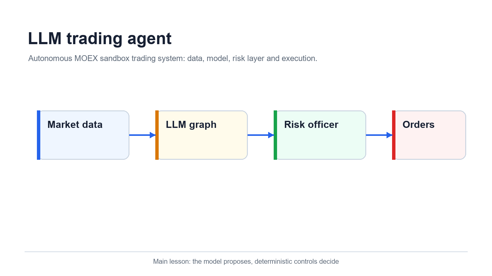
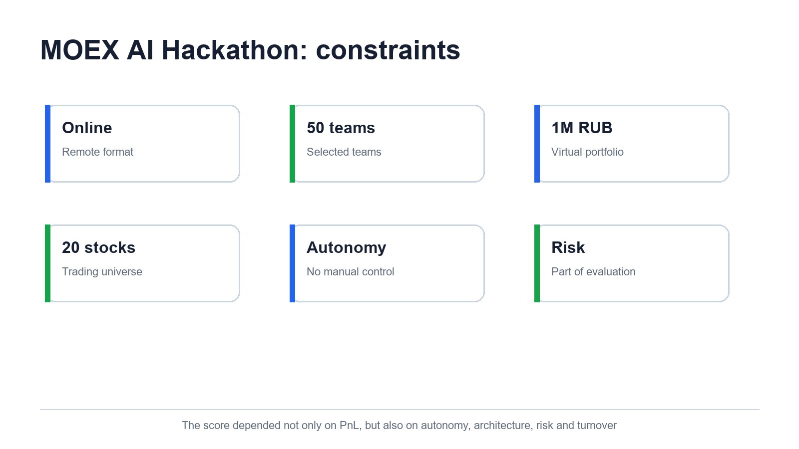
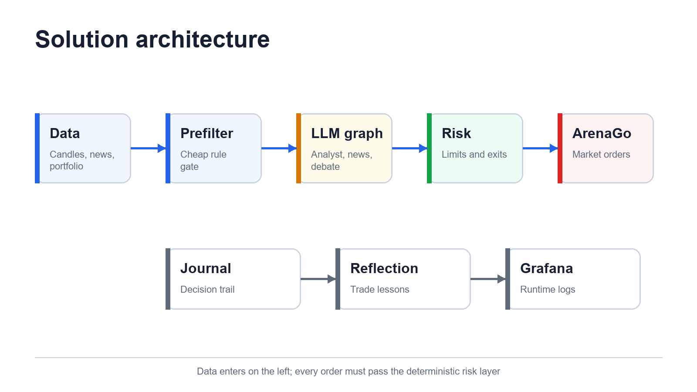
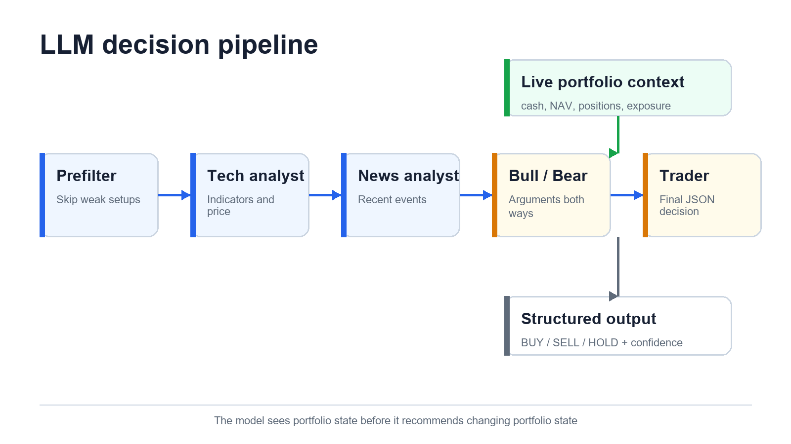
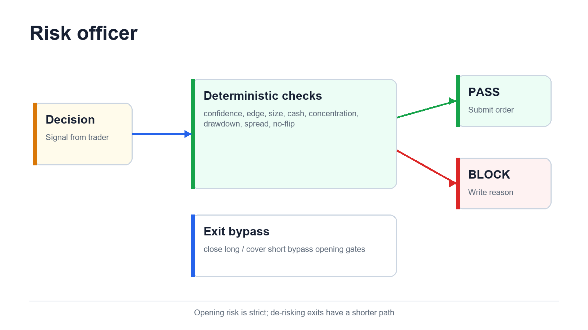
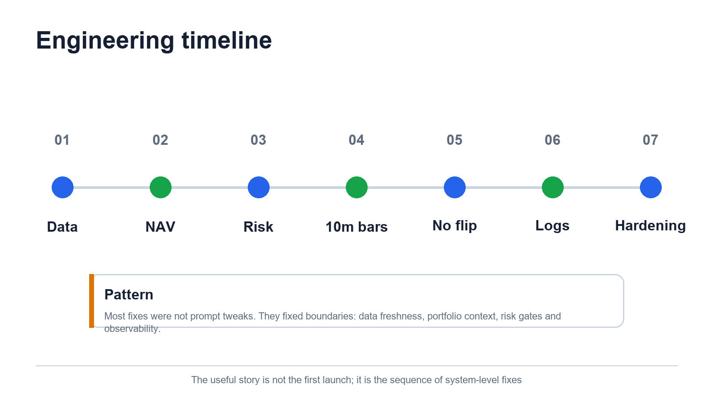
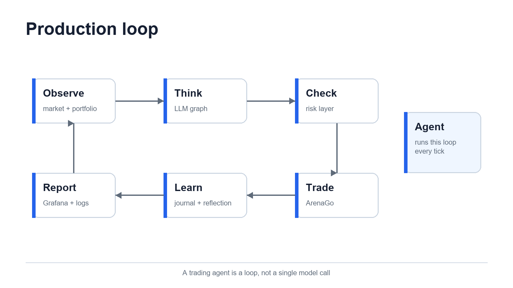

# Мы отправили LLM торговать на Мосбиржу. Сложнее всего оказалось не предсказывать рынок



На третьем торговом тике наш агент отправил заявку по GAZP с `quantity=758`. ArenaGo вернул `HTTP 200`, цену 122,62 рубля и `success=true`. Стоимость заявки составила 929 459,60 рубля, комиссия - 464,73 рубля. Свободными остались 484,42 рубля.

С технической стороны всё сработало безупречно: данные пришли, LLM приняла решение, API исполнил приказ. С точки зрения управления портфелем агент почти одним движением лишил себя манёвра.

Этот эпизод хорошо описывает весь наш MOEX AI Hackathon. Главные проблемы возникали не там, где модель читала график. Они прятались между слоями: в единицах количества, состоянии портфеля, устаревших свечах, комиссии, смысле BUY и SELL, порядке исполнения заявок и поведении при отказе внешнего API.

Формулу, вокруг которой в итоге сложилась система, можно записать одной строкой:

> LLM формирует торговое намерение. Детерминированный Risk Officer решает, можно ли его исполнять.

Ниже - инженерный разбор нашего агента: от условий соревнования и LLM-графа до live portfolio context, no-flip, reflection, Grafana и аварийного закрытия позиций. Это история экспериментальной системы для sandbox-контура, без инвестиционных рекомендаций и заявлений о доказанной доходности.

<cut />

## Что именно проверял MOEX AI Hackathon

На [официальной странице хакатона](https://hack-moex.ru/) указан общий период с 13 мая по 30 июня 2026 года и призовой фонд 1 млн рублей. Разработка шла с 13 по 27 мая, проверка агентов в реальном времени - с 27 мая по 10 июня, награждение планировалось до конца месяца.

Задача звучала коротко: создать агента на базе открытого генеративного ИИ, который после запуска автономно управляет портфелем. Система должна анализировать цену, объём, индикаторы и другие факторы, выбирать BUY, SELL или HOLD, соблюдать риск-менеджмент и оставлять воспроизводимый журнал работы.

Каждая команда получила 1 млн виртуальных рублей. По данным [Московской биржи](https://www.moex.com/n101397), в соревнование прошли 50 команд. Жюри оценивало автономность, прозрачность алгоритмической логики, качество данных, риск-контур, оборот и итоговый размер виртуального капитала.

[Хабр писал](https://habr.com/ru/news/1043786/), что организаторы получили 340 заявок, а торговля была ограничена двадцатью акциями. За две недели участники совершили около 17 тысяч сделок. Самая показательная пара цифр появилась уже во время торгов: один из лучших агентов провёл 875 операций, а участник с максимумом в 2539 операций оказался последним по доходности.



В этой постановке доходность была видимой частью задачи. Под ней лежал более суровый тест: сможет ли агент работать несколько недель без ручной опеки и не разрушить портфель из-за одного удачного на вид ответа модели.

## Почему BUY, SELL и HOLD недостаточно

В классификаторе рынка трёх меток хватило бы. В портфельной системе направление заявки ничего не говорит об экономическом смысле операции.

```text
position > 0  + SELL -> close_long
position < 0  + BUY  -> cover_short
position = 0  + BUY  -> open_long
position = 0  + SELL -> open_short
```

Если long уже открыт, продажа снижает риск. Та же продажа при нулевой позиции создаёт short. Покупка способна нарастить long или покрыть short. Поэтому любой гейт, который смотрит лишь на `signal`, рано или поздно блокирует полезный выход либо разрешает опасный вход.

На ранней версии trader всегда видел `Current position: 0`. Модель была обучена рассуждать аккуратно и не продавать без позиции, поэтому реальный long в ArenaGo не помогал: в картине мира LLM его не существовало. Одновременно NAV местами считался по средней цене входа, а не по текущей оценке. Вес инструмента, drawdown и свободный риск получались убедительными, но неверными.

С этого места архитектура перестала быть линейной цепочкой «котировки -> prompt -> ордер». Портфель пришлось сделать полноправной частью состояния графа.

## Как устроен один торговый тик

Финальный scheduler запускал цикл раз в 20 минут и работал с 10-минутными свечами. Эти значения отвечают за разные вещи: свеча задаёт детализацию рынка, а тик - частоту полного агентского решения.



В начале тика агент запрашивает позиции, доступный cash, сделки за день и размеры лотов. Затем он собирает свечи и общий fast/mid market context. После этого работа делится на две фазы.

В первой фазе тикеры анализируются параллельно. Для каждого инструмента строится snapshot, запускается prefilter и, если ситуация достойна затрат, проходит LLM-граф. Параллелизм здесь безопасен: агенты ещё ничего не покупают и читают один стартовый снимок портфеля.

Во второй фазе результаты перемешиваются и обрабатываются последовательно. Risk Officer проверяет решение, scheduler отправляет заявку и сразу обновляет локальные cash, позиции, цены и NAV. Следующий тикер видит уже изменившийся портфель. Именно этот шаг защищает от сценария, где десять независимых решений по 15% капитала одновременно считают, что деньги всё ещё свободны.

```text
tick start
  -> portfolio + trades + lot sizes
  -> candles + fast/mid market context
  -> parallel: prefilter and LLM graph per ticker
  -> sequential: risk, order, live portfolio update
  -> journal, reflection, metrics
  -> sleep = 20 minutes - elapsed tick time
```

Пауза считается от начала предыдущего тика. Если анализ занял семь минут, scheduler ждёт ещё тринадцать. Старый вариант ждал полные двадцать минут после завершения и незаметно растягивал реальный ритм системы.

## Данные: корректный JSON на старом рынке

Самый неприятный инцидент с данными выглядел тихо. Мы перевели анализ на 10-минутные свечи, индикаторы продолжили считаться, ответы LLM оставались связными, ошибок API не было. Позже выяснилось, что загрузчик мог получить первую, самую старую страницу длинного диапазона. Последняя строка DataFrame формально существовала, но к текущему рынку отношения уже не имела.

Никакой prompt не способен исправить цену из прошлого.

Мы временно вернулись на 60-минутный режим, добавили постраничную загрузку Algopack и проверку свежести, затем снова включили 10m. Если последняя свеча старше допустимого окна, тикер пропускается до LLM. В текущем клиенте отдельное событие `algopack.candles.stale` срабатывает при подозрительно старом результате.

Переход на другой таймфрейм затронул почти весь контур. Для 10m понадобились другое окно истории, новый масштаб волатильности, иной горизонт expected move и перенастройка prefilter. Порог, который хорошо отделяет шум на часовом баре, способен выключить большую часть торговли на десятиминутном.

Общий рынок мы описывали двумя окнами: fast на 60 минут и mid на 240 минут. В контекст попадали доходности, ширина рынка и режим, но без механического приказа «рынок растёт - покупай». Мы успели добавить directional bias, увидели его склонность усиливать односторонние позиции и убрали. Рыночный фон сообщает обстановку; решение по тикеру должно опираться на его признаки, текущую позицию и соотношение риска к движению.

## Что делает LLM-граф

Сначала мы складывали весь контекст в один prompt. Он быстро стал дорогим и плохо диагностируемым, поэтому работу разделили между ролями.

Prefilter проверяет технический snapshot до обращения к модели. Слабая или плоская ситуация заканчивается ранним HOLD. Technical analyst получает готовые индикаторы и описывает trend, momentum, volatility и уверенность. News analyst читает новости в карантинном контуре: сырой текст не попадает прямо к узлу исполнения. Bull и bear формулируют встречные тезисы, после чего trader принимает финальное решение.



Мы распределили модели по цене вызова. Analyst, news и debate работали на DeepSeek V4 Flash. Финальный trader использовал DeepSeek V4 Pro, потому что именно он сводил противоречивые аргументы с портфелем и отвечал за структурированный контракт. Новых дорогих вызовов ради проверок мы не добавляли: ограничения живут в Python.

Trader получает сжатый контекст. Вместо полного JSON дебатов ему передаётся последний раунд, тезис каждой стороны и по два сильных аргумента. Новости ограничены sentiment, confidence и тремя событиями. Это уменьшает расход токенов и оставляет в prompt то, что влияет на решение.

Ответ валидируется моделью Pydantic:

```json
{
  "signal": "BUY",
  "size_pct": 0.08,
  "confidence": 0.67,
  "reasoning": "Bull thesis has clearer 1-2h edge after costs."
}
```

В LLM-контракте `size_pct` ограничен диапазоном от 0 до 0,15. Финальное количество пересчитывает Risk Officer по live cash, цене, размеру лота и портфельным лимитам. Для HOLD размер принудительно обнуляется уже в коде. При исключении LLM узел возвращает безопасный HOLD с нулевой уверенностью.

В финальные часы разработки нашёлся менее очевидный сбой. Fallback вернул `{"signal": "HOLD", ...}` без `confidence`, и Pydantic остановил разбор. Решение было маленьким: безопасный default `confidence=0.0` в схеме. Последствие было крупнее строки фикса, потому что автономный цикл больше не падал из-за необязательного для человека поля.

## Live portfolio context: модель должна знать, чем уже владеет

Trader видит signed position по тикеру, комиссию на одну заявку и живой снимок всего портфеля:

```text
NAV 1004962.21 RUB
cash 926351.51 RUB
gross exposure 7.82% NAV
net exposure 2.41% NAV
current ticker weight 4.56% NAV
open positions 2
```

Это иллюстрация формата, а значения меняются после каждой исполненной заявки. Масштаб решения привязан к актуальному портфелю, а итоговый `quantity` пересчитывается по live cash, цене и риск-ограничениям, а не по стартовому миллиону.

Для ArenaGo пришлось отдельно разобраться с тем, как платформа учитывает short. При открытии long и short она блокировала cost basis из доступного cash. Наивная формула `cash + signed_position * last_price` давала двойной учёт и могла показать NAV около минус 652 тысяч вместо величины рядом с миллионом.

В production-коде оценка строится так:

```text
NAV = available_cash + sum(cost_basis + unrealized_pnl)

long pnl  = qty * lot * (last - average)
short pnl = abs(qty) * lot * (average - last)
```

Текущие цены берутся по всем открытым позициям. Если live price получить не удалось, используется last price из ArenaGo, а затем average price как крайний fallback. Такое каскадирование лучше идеальной формулы, которая рушит весь тик из-за одного недоступного инструмента.

Размер лота входит в каждую денежную формулу. Инцидент с GAZP из начала статьи возник на стыке `quantity`, цены акции и лота. После него scheduler начал обновлять размеры лотов с MOEX, считать notional как `qty * lot_size * price` и ограничивать суммарные покупки одного тика долей NAV.

## Risk Officer: сначала понять тип операции

Risk Officer написан детерминированно. Он не спорит с trader о направлении рынка. Его работа - сохранить портфельные инварианты и корректно интерпретировать намерение.



Порядок проверок принципиален:

```python
if fixed_take_profit_or_stop_loss(ctx):
    return protective_exit()

if signal_closes_long_or_covers_short(decision, ctx):
    return allow_exit_without_opening_gates()

return evaluate_opening_risk(decision, ctx)
```

Продажа существующего long и покрытие short обходят concentration, VaR, min edge, confidence и tick allocation. Эти операции уменьшают риск. Если применить к ним пороги открытия, позиция может застрять лишь потому, что модель дала низкий confidence на выход.

Новый риск проверяется строже. В финальной конфигурации минимальная уверенность составляла 0,35, вес одного инструмента ограничивался 15% NAV, сектор - 35%, cash buffer - 2%, а суммарные BUY-заявки одного тика - 30% NAV. Дополнительно работали лимиты drawdown, дневного убытка и приближение VaR.

Min edge сравнивает ожидаемое движение с максимумом из порога 0,15% и round-trip комиссии. Комиссия ArenaGo составляла 0,05% на каждую сторону, поэтому полный вход и выход начинался примерно с 0,10% до спреда и ошибки прогноза. Оценка edge привязана к наблюдаемой волатильности:

```text
estimated_edge = confidence * sigma_per_bar * horizon_multiplier
required_edge  = max(0.15%, round_trip_commission)
```

Для открытых позиций работал fixed take-profit и stop-loss на уровне плюс/минус 2% от средней цены. Мы также экспериментировали со ступенчатой фиксацией прибыли на 0,7%, 1,2% и 2%, включая защиту от повторения одной ступени каждый тик. В стабильной production-конфигурации оставили более простой fixed bracket: его легче объяснить и проверить на коротком соревновании.

No-flip закрывает ещё один класс проблем. Противоположный сигнал сначала доводит позицию до нуля. Открытие другой стороны разрешается лишь на следующем тике с новой гипотезой. Иначе один SELL способен одновременно закрыть long и открыть short, а risk gate видит смесь снижения и увеличения риска в одной заявке.

## Как мы боролись с overtrading

Цифры соревнования быстро показали, что количество действий плохо заменяет качество. Агент с 2539 операциями занял последнее место по доходности, тогда как участнику с положительным результатом хватило 875 сделок. Это не доказывает универсальную оптимальную частоту, зато хорошо показывает цену бессмысленного churn.

Наш первый риск-контур был слишком мягким и позволял серии похожих сделок. Затем мы затянули confidence, min edge и no-flip. После этого бот временами становился чересчур пассивным: правильный по смыслу gate отбрасывал почти все короткие сигналы, потому что волатильность 10m меньше часовой.

Пришлось разделить две задачи. Turnover monitor отвечает, успевает ли система набрать требуемый оборот. Risk Officer отвечает, допустима ли конкретная заявка. Monitor пишет pace в логи, но не приказывает покупать ради плана.

Мы не искали один магический threshold. Смотрели распределение причин блокировки, долю HOLD, фактический оборот, комиссию и поведение уже открытых позиций. В cheap/fair eval один из вариантов risk layer снизил block rate с 18% до 5% на одинаковых LLM-решениях: слабый min edge стал уменьшать размер вместо тотального запрета. Такой тест отделяет качество модели от поведения аллокатора.

Главный практический вывод здесь скучный и полезный: активность регулируется несколькими независимыми ручками. Частота тика, таймфрейм свечи, prefilter, confidence, edge, размер позиции и правила выхода не должны маскировать друг друга.

## Reflection без магии

Reflection-контур у нас включён. После закрытой сделки система связывает вход и выход, оценивает исход, формирует короткий lesson и пишет его в журнал. При доступной памяти релевантные уроки по тикеру добавляются в будущий trader prompt.

Это не переобучение весов модели. Контур хранит явные записи, которые можно прочитать, удалить и проверить:

```json
{
  "symbol": "NLMK",
  "source": "trade",
  "outcome": "loss",
  "lesson": "Do not add when the edge is weaker than transaction costs."
}
```

Пример показывает схему, а не реальную запись конкретной сделки. Помимо локального JSONL, архитектура поддерживает Qdrant для долгосрочного поиска. Meta-reflection агрегирует повторяющиеся уроки на уровне сессии.



Reflection полезен ровно до той границы, где остаётся наблюдаемым. Если прошлый вывод начинает скрыто менять стратегию, его невозможно отличить от дрейфа prompt. Поэтому lesson попадает в логи вместе с источником и сделкой, а торговые ограничения по-прежнему остаются в Risk Officer.

## Что продовые логи рассказали лучше бэктеста

У автономного агента есть две истории. Первая - список сделок. Вторая - цепочка причин, которая к ним привела. Без второй любая настройка превращается в гадание по PnL.

Мы сохраняли structured events для начала тика, portfolio snapshot, каждого ответа LLM, verdict Risk Officer, заявки, ответа ArenaGo и итогового состояния. В Grafana поверх Loki можно было восстановить путь одного тикера:

```text
scheduler.tick.start
node.analyst.ok
agent.trader.response
scheduler.ticker.done  risk_gate=... op_type=...
arenago.submit_order.ok
scheduler.tick.done
```

Так нашли позицию, которую trader считал нулевой, почти полностью потраченный cash, неверную NAV для short, stale candles, повторные входы и HOLD без confidence. Список сделок показывал симптом; лог с портфельным snapshot объяснял механизм.

Внешний webhook сначала казался быстрым способом смотреть ответы модели локально. На практике он добавил таймауты, шум и `429 Too Many Requests`. Мы убрали его из обязательного контура. Production-логи остались в stdout/Loki, решения - в journal, состояние приложения - в Grafana.

## Внешние API и бюджет модели

Торговый цикл зависит от MOEX/Algopack, новостных источников, Polza и ArenaGo. Любой сервис способен зависнуть в середине тика. Поэтому клиентам заданы таймауты и retries, а обработка одного тикера ограничена собственным временем. Ошибка по одному инструменту даёт HOLD/error для него и не останавливает остальные.

Самый неприятный отказ связан с оплатой LLM. Если баланс Polza закончится, trader больше не сможет решить, как закрыть уже открытые позиции. Мы добавили прямой failsafe, который не нуждается в LLM.

Перед тиком scheduler проверяет баланс. При значении ниже 0,01 рубля он фиксирует время истощения и пропускает новые решения. Если баланс не восстановился за 30 минут, система отправляет через ArenaGo закрывающие заявки по всем позициям: SELL для long, BUY для short. Событие сохраняется в journal, включая отклонённые ордера.

Такой fallback намеренно прост. В аварии агенту не нужна новая рыночная гипотеза; ему нужно перестать зависеть от недоступного компонента.

## Как менялась система

История коммитов получилась полезнее первоначальной схемы на доске. Каждый крупный поворот начинался с наблюдаемого противоречия.

Сначала мы научились считать signed position, lot size и mark-to-market NAV. Затем передали live portfolio context в trader, чтобы решения по тикерам перестали жить в отдельных мирах.

Следующий пласт касался поведения. No-flip развёл закрытие и новый вход. Fixed TP/SL дал Risk Officer право завершать позицию поверх HOLD. Commission-aware edge сократил сделки, где ожидаемое движение едва покрывало издержки.

После перехода на 10m пришлось отступить, починить pagination Algopack и вернуться к короткому таймфрейму уже с freshness guard. Fast/mid context добавил рынку память на один и четыре часа; directional bias мы удалили, когда он начал подталкивать решения вместо описания среды.

Финальный hardening был почти целиком эксплуатационным: таймауты внешних API, сжатый контекст trader, наблюдаемость ответов LLM, обход opening-гейтов для exits и default для отсутствующего confidence. Эти изменения не выглядят как новая торговая стратегия, но именно они отделяют демонстрацию от автономного процесса.

## Финальный production loop

В собранной системе каждый слой имеет узкую ответственность. Data layer получает рынок и проверяет свежесть. LLM-граф интерпретирует признаки и формирует намерение. Risk Officer классифицирует операцию и применяет ограничения. Scheduler управляет временем, последовательным исполнением и живым состоянием портфеля. ArenaGo исполняет market orders. Journal, reflection, Loki и Grafana сохраняют объяснимый след.



Код опубликован в репозитории [MOEX-AI-KOMANDA](https://github.com/namzhale/MOEX-AI-KOMANDA). Основные границы видны прямо по структуре:

```text
src/agent/data       market, Algopack, ArenaGo, news
src/agent/graph      analyst, news, debate, trader
src/agent/runtime    scheduler, risk, sizing, reflection
src/agent/memory     journal retrieval and Qdrant
src/agent/api        health and controlled runtime endpoints
tests                risk, scheduler, data and LLM contracts
```

## Что этот эксперимент не доказал

Sandbox близок к реальному торговому контуру по форме, но не равен брокерскому исполнению. В нём другая модель ликвидности, ограниченный universe и упрощённые market orders. Две недели не дают надёжной статистики по режимам рынка. Пара удачных дней не подтверждает alpha, а красивое объяснение LLM не превращает сигнал в причинную модель.

Параметры риска мы меняли по логам и коротким eval-прогонам. Для серьёзной проверки понадобились бы event-time replay без look-ahead, отдельные train/validation/test периоды, реалистичное проскальзывание, устойчивость к задержкам новостей и shadow trading до доступа к капиталу.

Есть и системный риск: модель, источник данных и API могут измениться независимо от кода. Поэтому версия prompt, схема ответа, model id, входной snapshot и verdict risk layer должны сохраняться вместе. Иначе воспроизвести решение через неделю уже невозможно.

## Что мы вынесли из хакатона

LLM хорошо собирает разнородный контекст, сравнивает аргументы и формулирует гипотезу. Портфельные инварианты требуют другого инструмента: короткого, детерминированного и покрытого тестами кода.

Самым ценным компонентом нашей системы оказался не самый умный prompt. Им стала граница ответственности. Trader может ошибиться в направлении, но не может самовольно превысить размер позиции. Risk Officer может заблокировать вход, но не должен запереть de-risking exit. Scheduler может пережить зависший тикер, а исчерпание LLM-баланса не оставляет портфель бесхозным.

MOEX AI Hackathon дал редкую возможность увидеть агентскую архитектуру под рыночным давлением. Пока всё спокойно, любой пайплайн выглядит разумно. Когда одновременно меняются цена, cash, позиции, ответы API и бюджет токенов, остаются только явно записанные контракты.

Именно поэтому после нескольких недель разработки наша главная формула не изменилась:

> Модель предлагает действие. Система отвечает за последствия.

## Источники

- [MOEX AI Hackathon: условия, этапы и требования](https://hack-moex.ru/)
- [Московская биржа подвела итоги MOEX AI Hackathon](https://www.moex.com/n101397)
- [Хабр: первые результаты автономных торгов](https://habr.com/ru/news/1043786/)
- [Открытый репозиторий решения MOEX-AI-KOMANDA](https://github.com/namzhale/MOEX-AI-KOMANDA)
